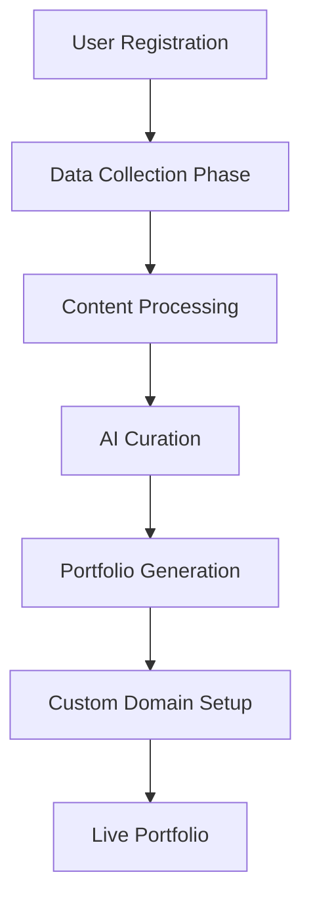

# Portfolio Generation Flow Documentation

This document explains the complete end-to-end portfolio generation flow in the Folyx platform, from data collection to final deployment.

## Overview

The Folyx platform generates AI-powered portfolios by collecting data from multiple sources, processing it intelligently, and creating personalized portfolio websites with custom domains.



## Phase 1: Data Collection

### 1.1 Platform Integrations (OAuth & Manual)

#### GitHub Integration
**Location**: `/integrations` → GitHub Card

**Flow**:
1. **OAuth Flow** (Preferred):
   - User clicks "Connect with GitHub"
   - Redirects to `/api/auth/oauth/github`
   - OAuth authorization at `github.com/login/oauth/authorize`
   - Callback to `/api/auth/oauth/github/callback`
   - Store tokens in `connected_platforms` table

2. **Username Flow** (Public Data):
   - User enters GitHub username
   - API call to `/api/integrations/github/connect`
   - Uses `GitHubModule.fetchPublicUserData()`
   - Stores connection with `access_token: "public_access"`

**Data Collected**:
```javascript
{
  profile: {
    id, username, name, bio, avatar_url, location, company, 
    blog, email, public_repos, followers, following
  },
  projects: [
    {
      id, title, description, url, technologies, metrics: {
        stars, forks, watchers, openIssues
      },
      dates: { created, updated, pushed },
      topics, isPrivate, isFork, license
    }
  ],
  skills: {
    languages: [{ name, count }],
    technologies: [...],
    totalRepositories
  },
  achievements: [...],
  socialMetrics: { totalStars, totalForks, recentActivity }
}
```

#### LinkedIn Integration
**Location**: `/integrations` → LinkedIn Card

**Options**:
1. **OAuth** (Limited API):
   - Basic profile info only
   - `/api/auth/oauth/linkedin`
   - Limited by LinkedIn's API restrictions

2. **Manual Data Export** (Recommended):
   - User exports data from LinkedIn
   - Upload CSV files
   - More comprehensive data

#### Resume/CV Upload
**Location**: `/content/resume`

**Flow**:
1. **File Upload**: 
   - Drag & drop or file picker
   - Supports: PDF, DOCX, DOC, TXT
   - Max size: 5MB

2. **Text Extraction**:
   - **PDF**: Client-side with PDF.js library
   - **TXT**: Browser File API
   - **DOCX/DOC**: Server-side processing

3. **Content Parsing**:
   - API: `/api/content-fetchers/parse-resume`
   - Uses `ResumeExtractor` module
   - AI-powered text analysis

**Data Extracted**:
```javascript
{
  personalInfo: { name, email, phone, location, linkedin, github },
  summary: "Professional summary text",
  experience: [
    { title, company, duration, description }
  ],
  education: [
    { degree, institution, duration, details }
  ],
  skills: {
    technical: [...], languages: [...], tools: [...], other: [...]
  },
  projects: [
    { title, description, technologies, url }
  ],
  certifications: [...],
  achievements: [...]
}
```

### 1.2 Data Storage

**Database Tables**:

1. **`connected_platforms`**:
```sql
- user_id (UUID)
- platform (TEXT) -- 'github', 'linkedin', etc.
- platform_user_id (TEXT)
- platform_username (TEXT)
- platform_display_name (TEXT)
- access_token (TEXT) -- OAuth token or 'public_access'
- refresh_token (TEXT)
- profile_data (JSONB) -- Structured platform data
- verified_at (TIMESTAMPTZ)
```

2. **`user_content`**:
```sql
- user_id (UUID)
- content_type (TEXT) -- 'resume', 'cover_letter', etc.
- original_text (TEXT) -- Raw extracted text
- structured_data (JSONB) -- Parsed structured data
- metadata (JSONB) -- File info, extraction method
```

## Phase 2: Content Processing & Curation

### 2.1 GitHub Content Processing

**Module**: `GitHubModule.js`

**Processing Steps**:
1. **Data Fetching**:
   - Use stored OAuth tokens or public API
   - `GitHubConnector.fetchUserData()`
   - Rate limiting & caching applied

2. **Project Filtering & Sorting**:
```javascript
// Filter criteria
- Exclude archived repositories
- Include forks only if they have stars (>5)
- Limit to top 50 repositories

// Sorting algorithm
const score = (stars * 2) + forks + (recency_factor)
```

3. **Content Enhancement**:
   - Fetch language statistics for each repo
   - Extract README content for top projects
   - Analyze topics and technologies

4. **Portfolio Optimization**:
```javascript
const options = {
  maxProjects: 12,
  includeForkedRepos: false,
  minStars: 0,
  sortBy: 'stars' // 'stars', 'updated', 'created'
}
```

### 2.2 AI-Powered Curation

**Module**: `ContentCurator.js` (Referenced in modules)

**Curation Criteria**:

1. **Quality Scoring** (Multi-factor):
   - **Popularity** (30%): Stars, forks, views, likes
   - **Recency** (20%): Last updated, recent activity
   - **Relevance** (20%): Match with user preferences/target role
   - **Completeness** (20%): Quality of documentation, description
   - **Uniqueness** (10%): Diversity, originality

2. **Selection Process**:
   - Filter content below quality threshold (0.7)
   - Rank by relevance to target role
   - Ensure technology diversity
   - Select optimal combination within constraints

3. **Achievement Detection**:
   - Notable repositories (>50 stars)
   - High follower count (>100)
   - Prolific contributions (>20 repos)
   - Recent activity patterns

### 2.3 Resume Data Processing

**Module**: `ResumeExtractor.js`

**Text Analysis Techniques**:

1. **Personal Information Extraction**:
```javascript
// Regex patterns for different data types
emailPattern: /\b[A-Za-z0-9._%+-]+@[A-Za-z0-9.-]+\.[A-Z|a-z]{2,}\b/
phonePattern: /\b(?:\+?1[-.\s]?)?\(?([0-9]{3})\)?[-.\s]?([0-9]{3})[-.\s]?([0-9]{4})\b/
linkedinPattern: /(?:https?:\/\/)?(?:www\.)?linkedin\.com\/in\/[a-zA-Z0-9-]+/
```

2. **Section Recognition**:
   - Header keyword detection
   - Content structure analysis
   - Context-aware parsing

3. **Skills Classification**:
   - Programming languages recognition
   - Technology stack identification
   - Soft skills extraction

## Phase 3: Portfolio Generation

### 3.1 Data Aggregation

**Process**:
1. **Collect All Sources**:
   - GitHub projects & profile
   - Resume/CV data
   - LinkedIn information (if available)
   - Manual content additions

2. **Data Merging**:
   - Resolve conflicts between sources
   - Deduplicate skills and experiences
   - Prioritize data sources (OAuth > Manual > Public)

3. **Portfolio Structure Creation**:
```javascript
{
  profile: {
    name, title, email, bio, avatar, location, 
    socialLinks: { github, linkedin, website }
  },
  projects: [ /* Curated and ranked projects */ ],
  experience: [ /* Work history from resume */ ],
  education: [ /* Academic background */ ],
  skills: {
    technical: [...], tools: [...], languages: [...]
  },
  achievements: [ /* Notable accomplishments */ ],
  metrics: {
    totalStars, totalRepos, yearsExperience, 
    topTechnologies, engagementLevel
  }
}
```

### 3.2 AI Content Enhancement

**OpenAI Integration**:

1. **Bio Generation**:
   - Analyze all collected data
   - Generate professional summary
   - Tailor to target role/industry

2. **Project Descriptions**:
   - Enhance existing descriptions
   - Add technical details
   - Highlight key achievements

3. **Content Optimization**:
   - SEO-friendly descriptions
   - Professional tone consistency
   - Industry-specific terminology

### 3.3 Template Application

**Template System**:
1. **Template Selection**:
   - Based on user preferences
   - Industry-specific layouts
   - Skill-level appropriate designs

2. **Dynamic Content Rendering**:
   - Responsive design adaptation
   - Content-driven layout adjustments
   - Performance optimization

## Phase 4: Portfolio Deployment

### 4.1 Subdomain Generation

**Process**:
1. **Subdomain Assignment**:
   - Format: `{username}.folyx.me`
   - Availability checking
   - DNS configuration

2. **Route Configuration**:
   - Dynamic routing: `app/[...slug]/`
   - Portfolio identification by subdomain
   - SEO metadata generation

### 4.2 Custom Domain Setup

**Domain Management**:
1. **DNS Configuration**:
   - CNAME record setup
   - SSL certificate provisioning
   - Domain verification

2. **Routing Logic**:
```javascript
// Middleware checks
if (isCustomDomain(host)) {
  // Serve portfolio for custom domain
  return portfolioContent
} else if (isSubdomain(host)) {
  // Serve portfolio for subdomain
  return portfolioContent
}
```

### 4.3 Performance Optimization

**Implementation**:
1. **Static Generation**:
   - Pre-built portfolio pages
   - CDN distribution
   - Image optimization

2. **Caching Strategy**:
   - API response caching
   - Browser caching headers
   - Database query optimization

## Phase 5: Analytics & Insights

### 5.1 Portfolio Analytics

**Tracking Metrics**:
- Page views and unique visitors
- Time spent on portfolio
- Contact form submissions
- Social link clicks

### 5.2 Performance Insights

**AI-Generated Recommendations**:
1. **Content Suggestions**:
   - Missing skill areas
   - Project improvement recommendations
   - Profile optimization tips

2. **Engagement Analysis**:
   - Most viewed sections
   - User behavior patterns
   - Conversion optimization

## Technical Architecture

### API Endpoints

```
/api/auth/oauth/{platform}              # OAuth initiation
/api/auth/oauth/{platform}/callback     # OAuth callback
/api/integrations/{platform}/connect    # Platform connection
/api/content-fetchers/parse-resume      # Resume processing
/api/content-fetchers/generate          # Portfolio generation
/api/portfolios                         # Portfolio CRUD
/api/portfolios/{id}/generate           # AI content generation
```

### Security Measures

1. **Authentication**:
   - Supabase Auth integration
   - Row Level Security (RLS)
   - OAuth token encryption

2. **Data Protection**:
   - Input validation
   - Rate limiting
   - CSRF protection

3. **Privacy Controls**:
   - User data ownership
   - Deletion capabilities
   - Access controls

## User Journey Flow

### Complete End-to-End Experience:

1. **Onboarding** (`/signin`)
   - User registration/login
   - Profile creation

2. **Data Collection** (`/integrations`)
   - Connect GitHub account
   - Upload resume/CV
   - Connect LinkedIn (optional)

3. **Content Review** (`/content/resume`)
   - Review extracted data
   - Edit/enhance information
   - Validate accuracy

4. **Portfolio Creation** (`/portfolios/new`)
   - Select template
   - Configure preferences
   - Initiate generation

5. **Portfolio Customization** (`/portfolios/{id}`)
   - Review generated content
   - Make adjustments
   - Preview changes

6. **Publication** (`/portfolios/{id}/settings`)
   - Configure subdomain
   - Set up custom domain (optional)
   - Publish portfolio

7. **Monitoring** (`/analytics`)
   - View performance metrics
   - Track visitor engagement
   - Receive optimization suggestions

## Future Enhancements

### Planned Features:

1. **Additional Integrations**:
   - Dribbble for designers
   - Stack Overflow for developers
   - Behance for creatives

2. **Advanced AI Features**:
   - Automated content updates
   - Competitive analysis
   - Industry trend integration

3. **Collaboration Tools**:
   - Team portfolios
   - Recommendation systems
   - Peer reviews

4. **Enterprise Features**:
   - Bulk portfolio generation
   - Custom branding
   - Advanced analytics

This comprehensive flow ensures that users can create professional, data-driven portfolios with minimal manual effort while maintaining full control over their content and presentation.